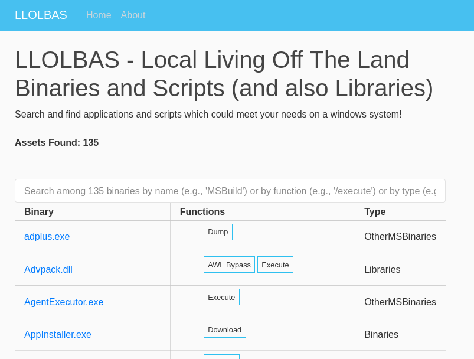
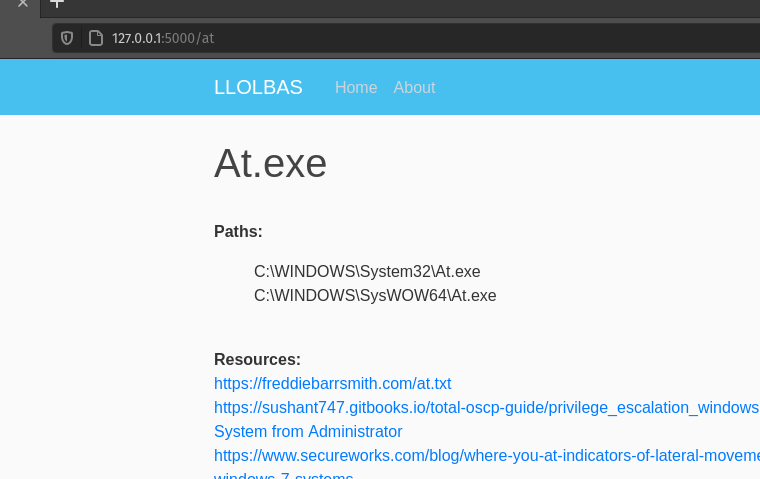

# LLOLBAS (Local LOLBAS)

[](https://www.python.org/)
[](https://www.google.com/url?sa=i&url=https%3A%2F%2Fwww.thewholesomedish.com%2Fspaghetti%2F&psig=AOvVaw3OneeN_AB3XxZzgCPPTtfv&ust=1614550372646000&source=images&cd=vfe&ved=0CAIQjRxqFwoTCJjQwf2Ki-8CFQAAAAAdAAAAABAD)
[](https://www.youtube.com/watch?v=kyti25ol438)

[](https://github.com/MattKeeley/LLOLBAS/actions)

`llolbas` is a repo containing a localized and off-line version of the ever
popular Living Off the Land Binaries and Scripts
([LOLBAS](https://lolbas-project.github.io)) project.

## Why?

We noticed two problems when using tooling such as GTFO bins and LOLBAS:

1. They are online
2. They have every binary imaginable.

For point 1, this becomes an issue for engagements where a red-teamer or
penetration tester may not have access to the outside world. Alternatively,
the domain for LOLBAS may be blocked, detected, or just otherwise down.

In point 2, we see while it is nice to have an entire listing of every binary
which could be used to download, upload, execute, or what have you, in the
enumeration phase, you really only care about what accomplishes your goal.
For this reason, we built in functionality to allow for curating of the entries
in the LOLBAS database based on what binaries actually exist on your target
machine. Nothing too crazy, but damn if it ain't helpful.

**Disclaimer:** Some of the code/scripts/script examples will still need to
be called for. This is something we are looking to integrate later on.

## How?

Using the power of one of our included ingestors, you can throw one of those
bad boys on a target server and download the outputted base64 encoded JSON
file. Using the instructions below, you can then start up your Local LOLBAS
instance and begin browsing away while not on the target.

**Note:** The digestor will begin a Flask server on a local port of choosing
or default 5000.

## Where?

Currently we are only hosting the project on GitHub however, there is talk
to make this a pypi/pip package through one of the pip repositories. Since
all the assets are primarily in a huge dictionary, there is no tossing around
dependencies and downloading from other repositories.

## Getting Started

`llolbas` requires **Python 3.6+**. Python 2 is not supported.

`llolbas` can be installed as a module using `pip` and the requirements.txt file
in the repository or by directly calling upon the git repo using the git
modifier for pip.

### Installing Via Repo

First Git clone the repository:

```console
git clone https://github.com/AZSERG/LLOLBAS.git
```

For users not planning on doing development work, just use the basic
requirements.txt:

```console
pip install --requirement ./requirements.txt
```

### Installing Via Git + pip

In one simple step, you can use pip to pull and install a GitHub
repository:

```console
pip install git+https://github.com/AZSURGE/LLOLBAS.git
```

### Usage and Examples

`llolbas` can then be ran directly via the command line like so:

```console
llolbas is a local server and digester for LOLBAS.

llolbas is a command line program which allows a user
to not only run a local instance of the hit internet
resource LOLBAS, but also be able to digest output
from the included ingestor to allow for curated listing
of binaries which exist within a target Windows
computer.

EXIT STATUS
    This utility exits with one of the following values:
    0   Execution completed successfully.
    >0  An error occurred.

Usage:
  llolbas serve [options]
  llolbas serve (-p PORT | --port=PORT)
  llolbas serve (-d FILE | --digest=FILE)
  llolbas (-h | --help)
```

#### Options

```console
    -h --help                   Show this message.
    -d FILE --digest=FILE       If specified, use file
                                from one of the ingestors to
                                curate the LOLBAS served
                                output.
    -p PORT --port=PORT         Specify the port to start
                                the flask server on. [default: 5000].
```

#### Sample Output

The ingestor scripts should have no output. Debug mode can be turned on however,
if you wish to have some sort of verbosity. The output from these should be a
large base64 encoded JSON formatted string either written to a file or stdout.

Once `llolbas` is ran, we see the output from flask shown like so:

```console
 * Serving Flask app "llolbas.llolbas" (lazy loading)
 * Environment: production
   WARNING: This is a development server. Do not use it in a production deployment.
   Use a production WSGI server instead.
 * Debug mode: off
 * Running on http://127.0.0.1:5000/ (Press CTRL+C to quit)
```

Browsing to the website you are met with the following screen:



Clicking on an application you find will look like the following:



## Disclaimer

> This tool is only for testing and academic purposes and can only be used where
> strict consent has been given. Do not use it for illegal purposes! It is the
> end user’s responsibility to obey all applicable local, state and federal laws.
> Developers assume no liability and are not responsible for any misuse or damage
> caused by this tool and software.

## Credit

The credit for all the LOLBAS content goes to the
[LOLBAS-Project](https://github.com/LOLBAS-Project).

## Contributing

We welcome contributions! Please see [`CONTRIBUTING.md`](CONTRIBUTING.md) for
details.

## License

This project is licensed under the GPLv3 License - see the [LICENSE](LICENSE)
file for details
